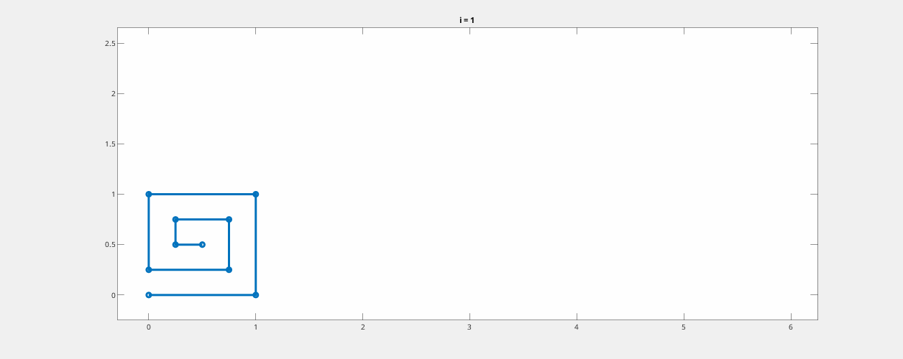
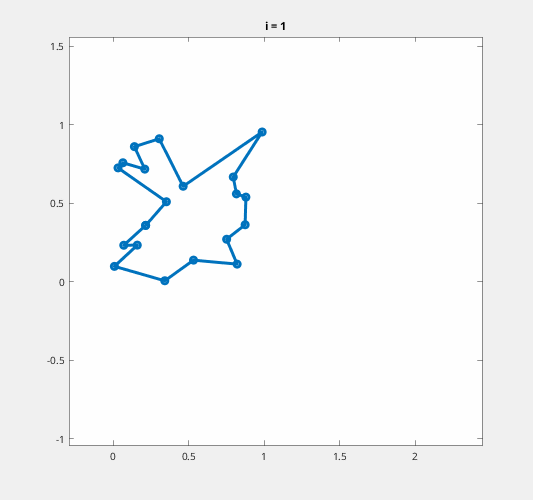
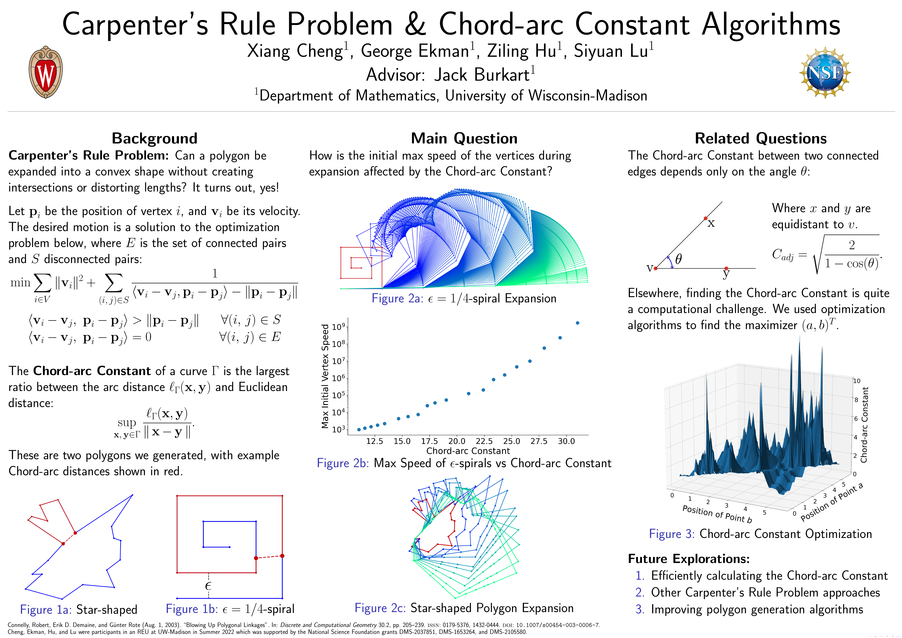

# Carpenter's Rule Problem and Chord-arc Constant Algorithms

Advisor: Jack Burkart

Students: Xiang Cheng, George Ekman, Ziling Hu, Siyuan Lu

University: University of Wisconsin - Madison

## Description

Our project aims to explore a computational geometry problem, Carpenter’s Rule Problem, and relate to the Chord-arc Constant with an optimization-based approach. 

The Carpenter’s Rule Problem asks if any polygon or any arc composed of line segments can be straightened to a convex polygon or line, respectively. During this process, the polygon should not be allowed to cross itself, and the lengths of edges must stay fixed. This problem was solved by Connelly, Demaine, and Rote in 2003 by turning this question into an optimization problem very similar to linear programming. 

Our goal in this project is to find numerical evidence of a universal “speed” limit, which, under suitable assumptions and normalizations, depends only on the Chord-arc Constant of the curve, and further study the relationship between these two quantities. The Chord-arc Constant of a curve is the supremum of the ratio between the shortest arc distance and the Euclidean distance between any two points. Along the way, we have proved that for adjacent edges on a random polygon, the Chord-arc constant is achieved when two points are equidistant to the joint vertex. For non-adjacent edges, we found evidence that the initial speed limit of polygon expander is bounded by the Chord-arc Constant. 

In 2004, Cantarella, Demaine, Iben, and O’Brien discovered an energy-driven approach to Carpenter’s Rule Problem. The motivation arises in various contexts throughout science and engineering such as robot-arm folding and computer graphics. Our current interest lies in building optimization models to demonstrate this problem using the energy-driven approach. 

## Examples

## Organization

- `docs`: Lecture notes and other miscellaneous files
- `matlab`: MATLAB code for the project
- `python`: Python code and Jupyter notebooks for the project
- `poster`: The poster TeX code and figures for our Summer REU Poster

## Summer 2022 REU at UW-Madison

- [Presentation Video](https://youtu.be/63-uckn3nbU)
- [Poster](poster/Carpenter_s_Rule.pdf): 
